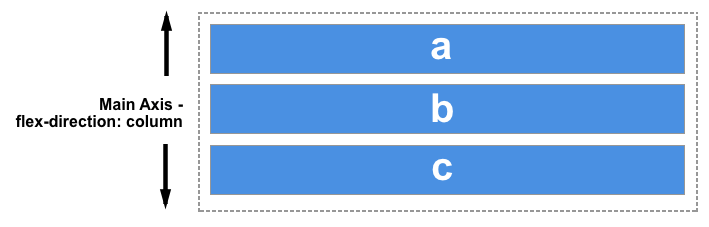

# 01 - Elementary

## Folder Structure

## Syntax

## Elementary Selectors

- general

- tag name
- class
- id

## Box Model

### [The_box_model](https://developer.mozilla.org/en-US/docs/Learn/CSS/Building_blocks/The_box_model)

- Content

  - Width (min-width, max-width)

  - Height (min-height, max-height)

- Padding

- Margin

- border

## Box-sizing :

### [box-sizing](https://developer.mozilla.org/en-US/docs/Web/CSS/box-sizing)

	 
* content-box
* border-box

## CSS Reset

## Dynamic content

- VW -> ViewPort Width (like: 100vw)

- VH -> ViewPort Heigth (like: 100vh)

## Static content

Static size(Absolute width || Absolute height)

## Reusability

## Units

- ### Absolute Lengths

  | Unit Name | Unit Description             |
  | --------- | ---------------------------- |
  | cm        | centimeters                  |
  | mm        | millimeters                  |
  | in        | inches (1in = 96px = 2.54cm) |
  | px        | pixels (1px = 1/96th of 1in) |
  | pt        | points (1pt = 1/72 of 1in)   |
  | pc        | picas (1pc = 12 pt)          |

- ### Relative Lengths

  | Unit Name | Unit Description                                                                                           |
  | --------- | ---------------------------------------------------------------------------------------------------------- |
  | em        | Relative to the font-size of the element (2em means 2 times the size of the current font) (Parent element) |
  | ex        | Relative to the x-height of the current font (rarely used)                                                 |
  | ch        | Relative to the width of the "0" (zero)                                                                    |
  | rem       | Relative to font-size of the root element                                                                  |
  | vw        | Relative to 1% of the width of the viewport                                                                |
  | vh        | Relative to 1% of the height of the viewport                                                               |
  | vmin      | Relative to 1% of viewport's\* smaller dimension                                                           |
  | vmax      | Relative to 1% of viewport's\* larger dimension                                                            |
  | %         | Relative to the parent element                                                                             |

- ### change default rem size :

  html {
  font-size: 62.5%; // This line turns 1rem to 10px instead of 16px
  }

## Fonts
 * font-family
 * font-style
    * normal
    * italic
    * oblique
 * font-weight
     * normal
     * bold
     * 100
 * font-variant
 * font-size

## Display
 * none
 * block
 * inline
 * inline-block
 * flex
    ### 1-flex-direction
      * row 
      * row-reverse
      * column 
      * column-reverse

    ### 2-flex axis:
      * ### main 
          main is exact the flex-direction Horizontal or vertical type

           

          

      * ### cross 
          main is oposite of the flex-direction Horizontal or vertical type

           
          
           

    ### 3-justify-content
      This is the main axis selector
      * flex-start : `Default`
      * center
      * flex-end
      * space-between
      * space-around
      * space-evenly
    
    ### 4-align-items
      This is the cross axis selector
      * flex-start : `Default`
      * center
      * flex-end
      * stretch

    ### 5-flex-wrap
      This property switches flex container between one-line and multi-line
      * wrap
      * nowrap : `Default`
      * wrap-reverse

    ### 6-flex-flow  
      This property combines flex-direction & flex-wrap   `flex-direction and/or flex-wrap`
      * row
      * column
      * wrap
      * nowrap
      * row wrap
      * row nowrap
      * column wrap
      * column nowrap

    ### 7-flex-basis
      This property defines the size of any item according to the available space. It's initial value is: `auto`.

    ### 8-flex-grow
      This property defines the grow size in main axis from the flex-basis. It will stretch the item to the available space

    ### 9-flex-shrink

 * grid

## Overflow

## Z-index

---

# 02 - Intermediate

## Intermediate Selectors

- Element > element

- Element + element
- Element ~ element

## !important

## Calc()

## Min()

## Max()

## Pseudo-classes

- :root

## Pseudo-elements

## Transition

## Transform

## CSS Flexbox

## CSS Grid Layout

---

# 03 - Advanced

## Animation

## Media Query

## Filter (graphical effects)

- blur

- brightness

- contrast

- drop-shadow

- grayscale

- hue-rotate

- invert

- opacity

- saturate

- sepia

---

# 04 - Examples

## Icon style (`<i></i>`)

## Link style (``)

## Modal
